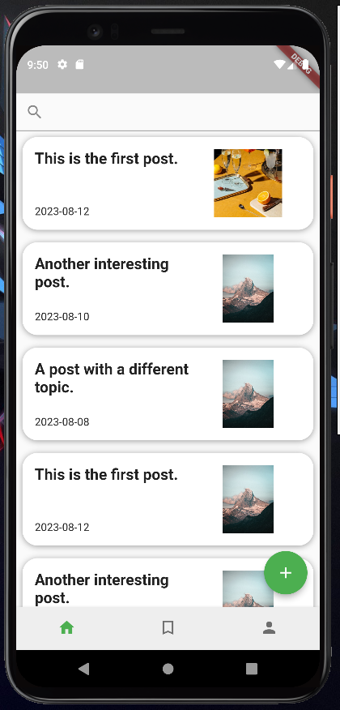
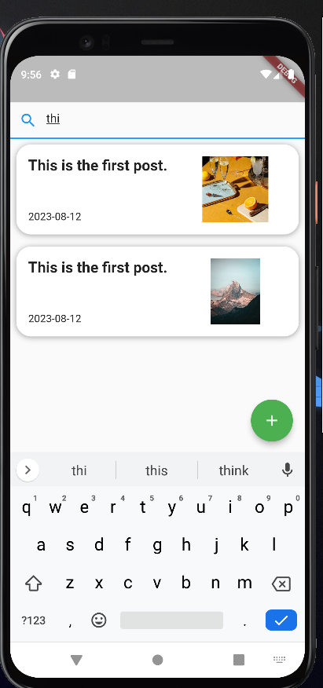
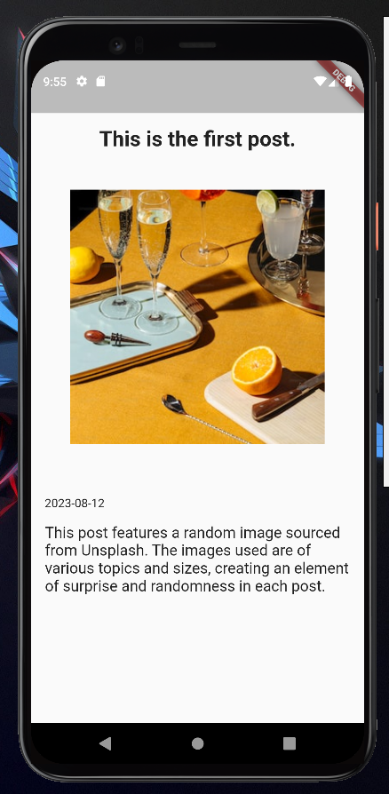
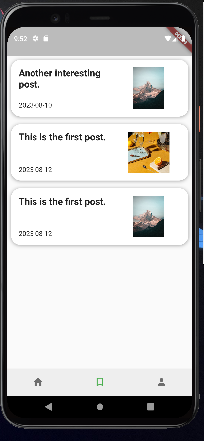
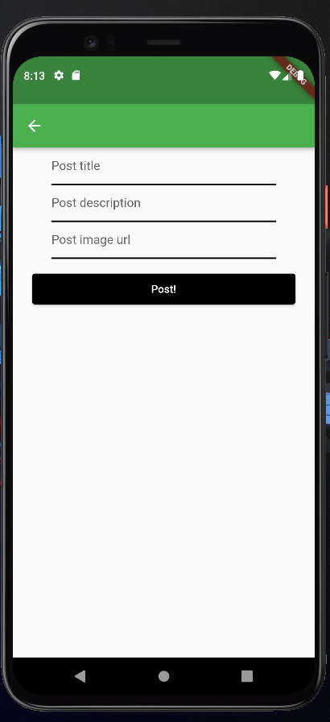
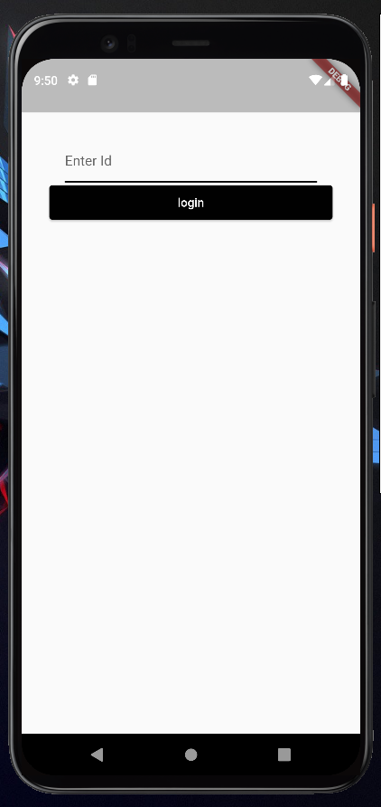
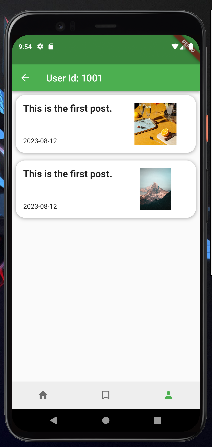

<h1>HW-2</h1>

<h2>Description</h2>

This is a blog app that allows a user to view all posts, view a single post in detail, add a new post, add a post to the user's bookmark, and search for a post using its title.

<h2>Pages</h2>

<h3>View all posts</h3>

This is a page where all posts in the app are displayed. Each post card has actions, which include:

<ul>
  <li><code>onTap()</code>: Redirects the user to the post page, displaying the full post.</li>
  <li><code>onLongPress()</code>: Adds the post to the bookmark.</li>
</ul>

The page also has a button to create a new post.

Additionally, the "View all posts" page has a search bar at the top, and it updates the list as the user types.

<h3>View a post</h3>

This page displays details about a single post.

<h3>Bookmark</h3>

This page displays all the posts added to the bookmark, and a user can remove a post from the bookmark by double-tapping it.

<h3>New post</h3>

In this page, a user can post a new post by providing the post image URL, title, and description.

<h3>Bonus feature</h3>

The user can log in by entering their user ID. On the profile page, all the posts the user has posted would be displayed.

<h4>Login page</h4>

<h4>Profile page</h4>

