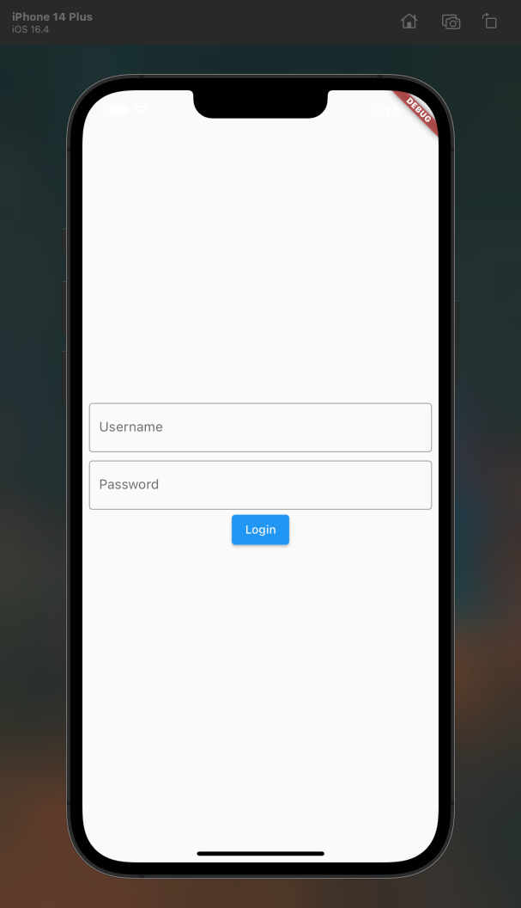
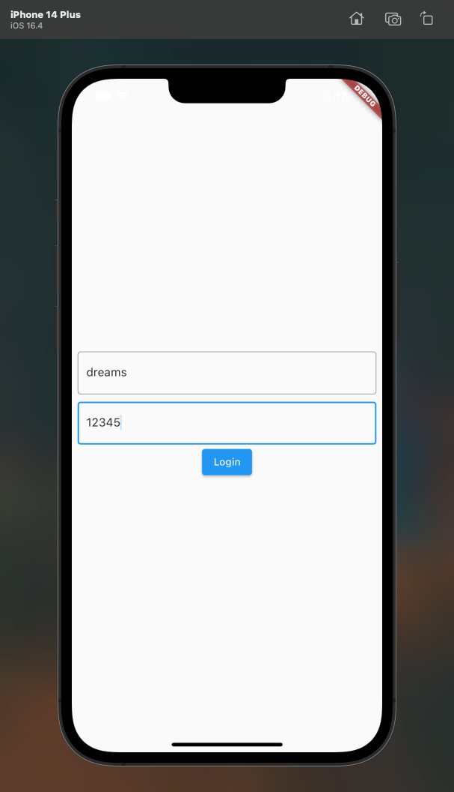
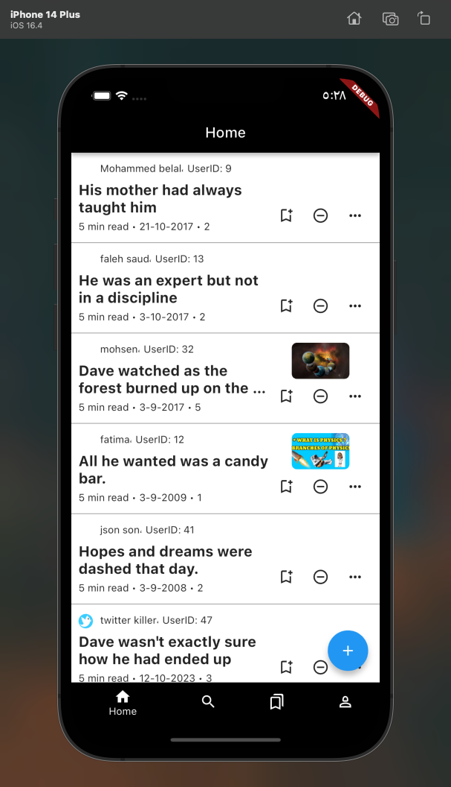
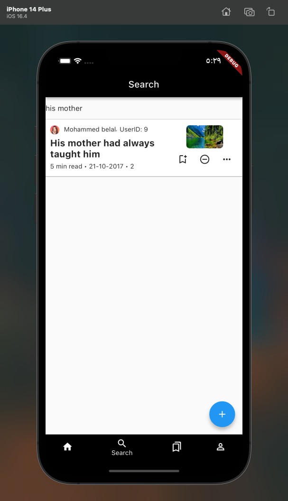
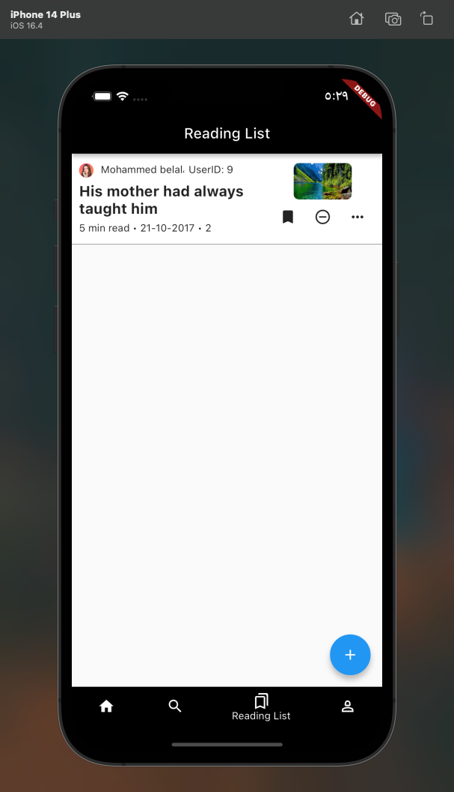
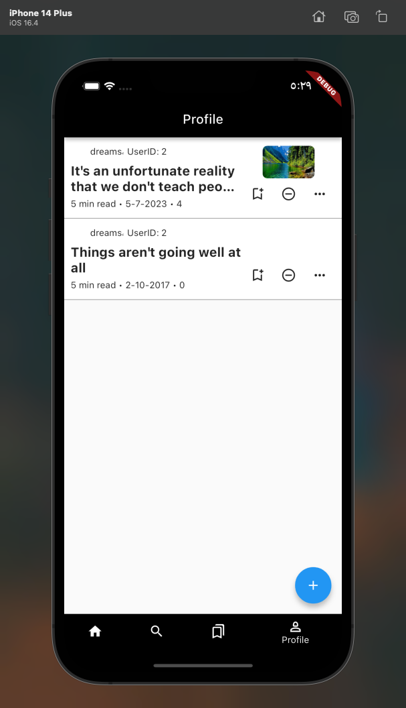
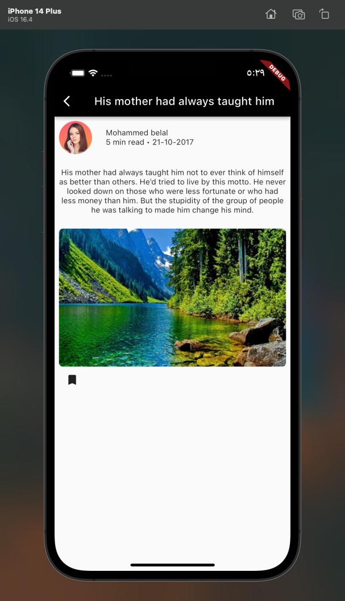
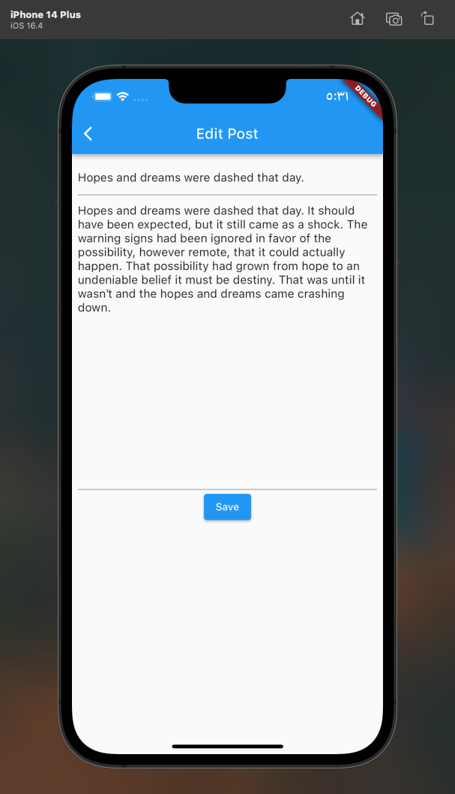
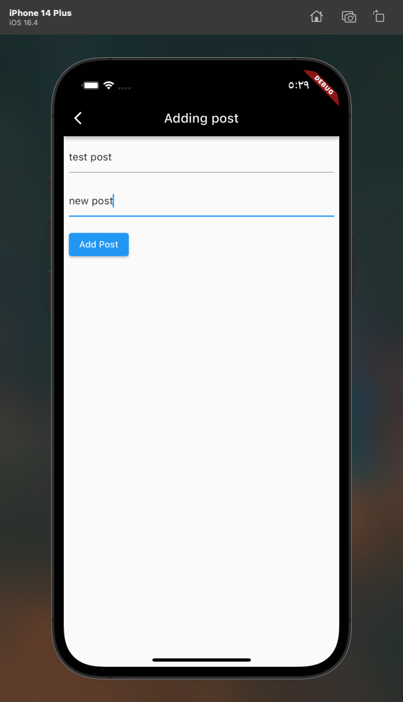
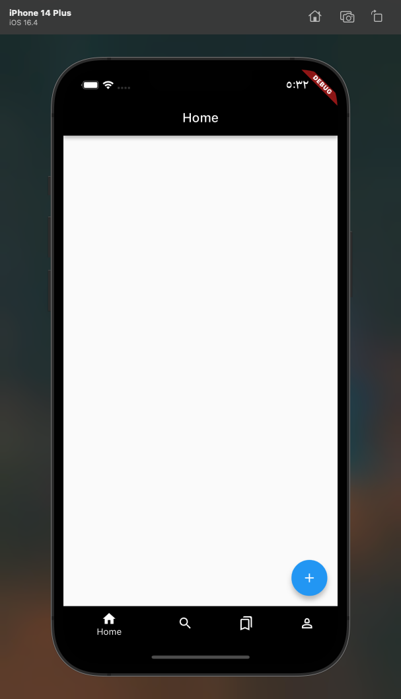

# in this readme I will talk about my blog app

### the first page in the app is login page, the default user and password is (dreams) (12345)

### after login the page will showup is home page of the app

### the second page is search page, you can search by title of post

### after that it is the bookmark page or reading list

### after after that the profile page

### you can read the body of the post

### and edit it

### you can add new posts

### or delete all posts

