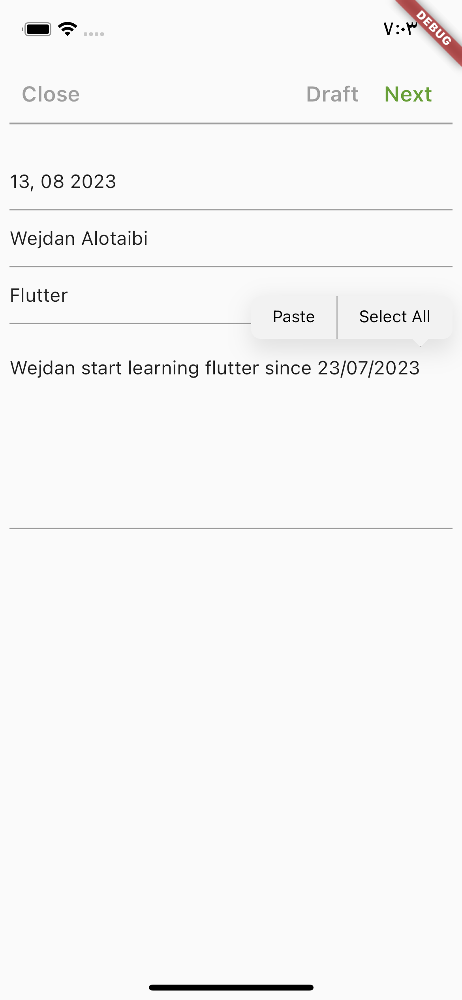

# blog_app

A new Flutter project is a blog..

## App Screens:

**This is a Home page**
- In this page you can: view all post,delete post, add post to reading list, and add new post.

**This is a page for add new post**
- You can fill the form to added new post

- As you see the post has been added.

**This is a page for search post by title**
- Write the title, and click enter.

**This is a Reading list page**\

**This is a page for read the post**
- You can read the post and update it as shown.

### Thanks for scrolling=)

